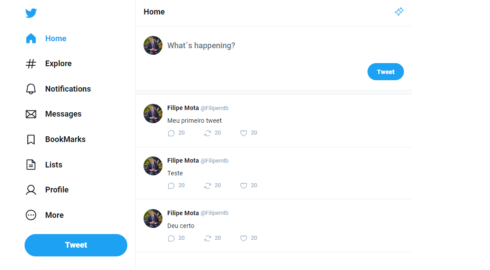

<h1 align="center"> UI-Twitter </h1>

Evento exclusivo e gratuito, promovido pela Rocketseat para ensino de tecnologias WEB. 

  <a href="#-tecnologias">Tecnologias</a>&nbsp;&nbsp;&nbsp;|&nbsp;&nbsp;&nbsp;
  <a href="#-projeto">Projeto</a>&nbsp;&nbsp;&nbsp;|&nbsp;&nbsp;&nbsp;
  <a href="#-layout">Layout</a>&nbsp;&nbsp;&nbsp;|&nbsp;&nbsp;&nbsp;
  <a href="#memo-licença">Licença</a>

 

  

## 🚀 Tecnologias

Esse projeto foi desenvolvido com as seguintes tecnologias:

- HTML / CSS
- ReactJS / TypeScript
- Vite
- Git e Github

## 💻 Projeto

Nesse projeto foi realizado o front-end de uma aplicação clone do twitter.
 
 
Para fazer esse desafio eu utlizei:
 

-  Conceito de compilers and Bundlers
-  O que são componentes
-  Propriedades / Children
-  Interações no React (laços de repetição)
-  Propriedade `Key`
-  Roteamento no React
-  Estados no React. (Conceitos de imutabilidade)
-  Fluxo de Renderizações

## 🔖 Layout

Você pode visualizar o layout do projeto através [DESSE LINK](https://www.figma.com/community/file/1202694130789327431). É necessário ter conta no [Figma](https://figma.com) para acessá-lo.

---